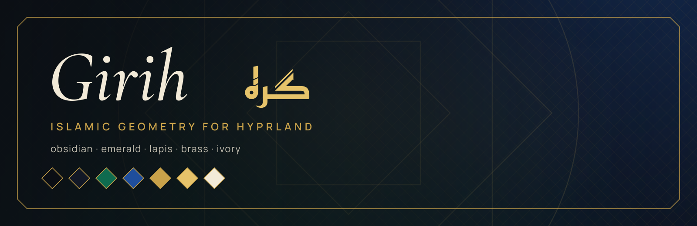

<p align="center"></p>

<p align="center"><sub>حَاسِبُوا أَنْفُسَكُمْ قَبْلَ أَنْ تُحَاسَبُوا<br>
the saying on the lock screen</sub></p>

# ◆ Girih

*Girih* (گره, knot) is the strapwork of Islamic geometry: lines that interlace into stars and never end. This desktop is cut from the same pattern. Windows are chamfered glass, borders run as gradients, the bar is a lintel with a keystone clock, and brass marks the one thing that has your attention.

## ◇ Palette

| | | |
|---|---|---|
| **obsidian** | `#0B0E14` | the ground |
| **slate** | `#121826` | panels |
| **emerald** | `#0F6B4F` | structure, focus |
| **lapis** | `#1F4E9C` | data, links |
| **brass** | `#C9A24A` | lines, hairlines |
| **gold** | `#E6C36A` | attention |
| **ivory** | `#F2EAD8` | text |

## ◇ The pattern

- **Windows**: chamfered glass, gradient borders, blur; the wallpaper is a lattice
  drawn in SVG (`hypr/girih/wallpaper.svg`)
- **Waybar**: lintel caps, a keystone clock, workspace slots ◆ ◇, NET / SYS / ◈
  drawers, VOL, BAT, NOTIF, IDLE
- **mawaqit**: the next prayer and its iqama; adhan and iqama banners with a bell
- **yawm**: Taskwarrior tasks due today, a list and a quick-add popup
- **Launcher** (SUPER+D), **hyprlock** with Arabic sayings, **GTK / Thunar**,
  the **Girih** icon theme
- **Terminals**: foot, alacritty, ghostty, tmux and a zsh prompt
- **Type**: Cormorant Garamond with Reem Kufi, Manrope with Readex Pro,
  JetBrains Mono

## ◇ Before you lay it

- Arch Linux (the package check uses `pacman`)
- Hyprland 0.56 or newer: the configuration is written in Lua
- waybar 0.15 or newer
- the packages in `girih/packages.txt`:

```sh
sudo pacman -S --needed $(grep -v '^#' girih/packages.txt)
```

## ◆ Laying the pattern

> [!WARNING]
> This is a whole desktop, not a colour scheme. It replaces every file listed
> in `girih/MANIFEST`: the Hyprland, waybar, terminal, tmux, GTK and fontconfig
> configuration among them, and the theme line in `~/.zshrc`.
> Everything it replaces is backed up first.

```sh
git clone https://github.com/houssemMekhelbi/hattin-girih.git
cd hattin-girih
./girih/restore.sh --dry-run   # show what would change, touch nothing
./girih/restore.sh             # apply
```

`restore.sh` then:

1. reports missing packages;
2. backs up every path it is about to replace to `~/themes/.backups/before-girih-<timestamp>/`;
3. copies the theme's `home/` over `$HOME` and removes the paths in its `ABSENT`;
4. points `~/.zshrc` at the theme's prompt;
5. applies its `gsettings.txt` and refreshes the font and icon caches;
6. builds the mawaqit-api image if it is missing, enables the user services and
   reloads Hyprland, waybar, hyprpaper, swaync and tmux.

`--files-only` copies the files and gsettings and leaves the services alone.

## ◇ Unpicking it

Copy the backup folder back over `$HOME`.

## ◇ Prayer times

Prayer times come from [mawaqit.net](https://mawaqit.net) through a local copy of
[mawaqit-api](https://github.com/mrsofiane/mawaqit-api), run by podman on 127.0.0.1.
List your mosques in `~/.config/mawaqit/mosques`, one `<mawaqit.net slug> | <label>`
per line; scroll or right-click the prayer module to switch between them.

## ◇ The other knots

This is one of the hattin themes. They share one behaviour (binds, workspaces,
bar modules) and differ only in look. Clone several side by side and run the
`restore.sh` of the one you want: each switch removes what the previous theme
left that the new one does not use.

## ◇ Licence

MIT, see [LICENSE](LICENSE). The fonts in `<theme>/home/.local/share/fonts/` are
under the SIL Open Font License; each licence text sits next to its font.
mawaqit-api (`<theme>/home/.local/share/mawaqit-api/`) is MIT, © Sofiane Louchene.
